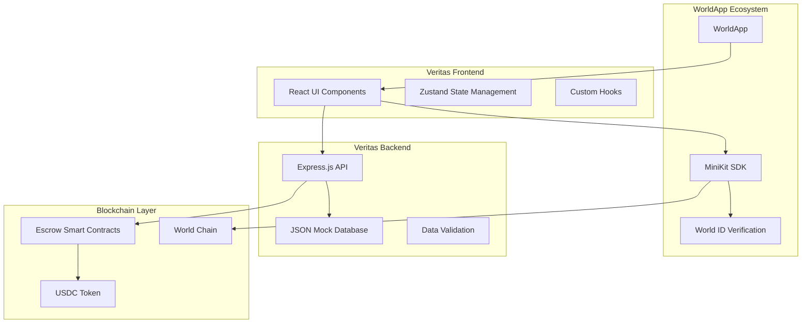
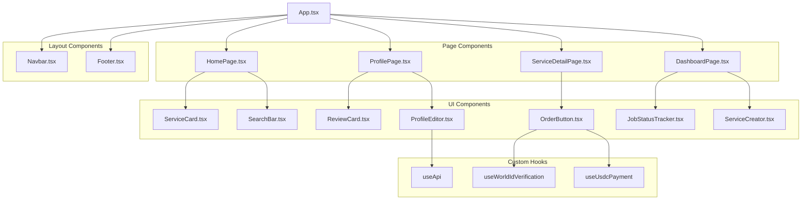

# Design Document

## Overview

Veritas is a decentralized freelancing platform built as a mini-application within the WorldApp ecosystem. The platform leverages World ID for human verification, USDC for payments, and smart contracts for secure escrow functionality. The architecture follows a monorepo structure with separate frontend, backend, and smart contract components, designed to provide a seamless user experience while maintaining decentralized trust and security.

## Architecture

### High-Level Architecture



### Technology Stack

**Frontend:**
- React 18 with TypeScript
- Tailwind CSS for styling
- Zustand for state management
- WorldCoin MiniKit-JS SDK for blockchain interactions
- Axios for API communication

**Backend:**
- Node.js with Express.js
- TypeScript for type safety
- JSON file-based mock database
- Express middleware for validation and error handling

**Smart Contracts:**
- Solidity for contract development
- Hardhat for development and testing
- World Chain (OP Stack compatible) for deployment

## Components and Interfaces

### Frontend Component Architecture



### API Interface Design

**Base URL:** `/api/v1`

**Authentication:** World ID verification status passed in headers

**Endpoints:**

```typescript
// User Management
GET    /users/:worldId              // Get user profile
POST   /users                      // Create user profile
PUT    /users/:worldId              // Update user profile

// Service Management
GET    /services                   // List services (with pagination/filters)
GET    /services/:serviceId        // Get service details
POST   /services                   // Create new service

// Job Management
POST   /jobs                       // Create new job order
GET    /jobs/user/:worldId         // Get user's jobs
PUT    /jobs/:jobId/status         // Update job status

// Review System
POST   /reviews                    // Submit review
GET    /reviews/user/:worldId      // Get user's reviews
```

### State Management Structure

```typescript
interface AppState {
  // User Authentication
  user: {
    worldId: string | null;
    isVerified: boolean;
    profile: UserProfile | null;
  };
  
  // Services
  services: {
    items: Service[];
    loading: boolean;
    filters: ServiceFilters;
  };
  
  // Jobs
  jobs: {
    asConsumer: Job[];
    asProvider: Job[];
    loading: boolean;
  };
  
  // UI State
  ui: {
    searchQuery: string;
    selectedCategory: string;
    notifications: Notification[];
  };
}
```

## Data Models

### User Model
```typescript
interface User {
  worldId: string;                    // Unique World ID
  createdAt: string;                  // ISO timestamp
  profile: {
    displayName: string;
    avatarUrl?: string;
    bio: string;                      // Max 500 characters
    location?: string;
    skills: string[];                 // Array of skill tags
    isProvider: boolean;
  };
  reputation: {
    averageRating: number;            // 1-5 scale
    completedJobs: number;
  };
}
```

### Service Model
```typescript
interface Service {
  serviceId: string;                  // UUID
  providerWorldId: string;            // Foreign key to User
  title: string;
  description: string;
  category: string;                   // Predefined categories
  price: number;                      // USDC amount
  createdAt: string;                  // ISO timestamp
}
```

### Job Model
```typescript
interface Job {
  jobId: string;                      // UUID
  serviceId: string;                  // Foreign key to Service
  consumerWorldId: string;            // Foreign key to User
  providerWorldId: string;            // Foreign key to User
  status: JobStatus;
  escrowContractAddress: string;
  createdAt: string;                  // ISO timestamp
  completedAt?: string;               // ISO timestamp
}

enum JobStatus {
  PENDING = "pending",
  ACCEPTED = "accepted",
  IN_PROGRESS = "in_progress",
  IN_REVIEW = "in_review",
  COMPLETED = "completed",
  CANCELLED = "cancelled",
  DISPUTED = "disputed"
}
```

### Review Model
```typescript
interface Review {
  reviewId: string;                   // UUID
  jobId: string;                      // Foreign key to Job
  reviewerWorldId: string;            // Who left the review
  revieweeWorldId: string;            // Who received the review
  rating: number;                     // 1-5 scale
  comment: string;
  createdAt: string;                  // ISO timestamp
}
```

## Error Handling

### Frontend Error Handling
- Global error boundary for React component errors
- API error interceptors with user-friendly messages
- World ID verification failure handling
- Payment failure recovery flows
- Network connectivity error handling

### Backend Error Handling
- Express error middleware for consistent error responses
- Input validation with detailed error messages
- Database operation error handling
- Smart contract interaction error handling

### Error Response Format
```typescript
interface ErrorResponse {
  success: false;
  error: {
    code: string;
    message: string;
    details?: any;
  };
  timestamp: string;
}
```

## Testing Strategy

### Frontend Testing
- **Unit Tests:** Jest + React Testing Library for components
- **Integration Tests:** API integration and user flow testing
- **E2E Tests:** Cypress for critical user journeys
- **Mock Testing:** Mock MiniKit SDK for development

### Backend Testing
- **Unit Tests:** Jest for API endpoints and business logic
- **Integration Tests:** Supertest for API endpoint testing
- **Mock Database:** Test with separate JSON files
- **Contract Integration:** Test smart contract interactions

### Smart Contract Testing
- **Unit Tests:** Hardhat + Chai for contract functions
- **Integration Tests:** Full escrow flow testing
- **Security Tests:** Reentrancy and overflow protection
- **Gas Optimization:** Test gas usage for all functions

### Test Coverage Goals
- Frontend: >80% component and hook coverage
- Backend: >90% API endpoint coverage
- Smart Contracts: 100% function coverage

## Security Considerations

### World ID Integration
- Verify World ID proofs on both frontend and backend
- Store minimal user data, rely on World ID for identity
- Implement rate limiting for verification attempts

### Smart Contract Security
- Use OpenZeppelin contracts for standard functionality
- Implement reentrancy guards
- Add access control for critical functions
- Conduct thorough testing before deployment

### API Security
- Input validation and sanitization
- Rate limiting on all endpoints
- CORS configuration for WorldApp integration
- Secure handling of sensitive data

### Data Privacy
- Store only necessary user data
- Implement data retention policies
- Provide user data deletion capabilities
- Comply with privacy regulations

## Performance Optimization

### Frontend Performance
- Code splitting for route-based chunks
- Lazy loading for heavy components
- Image optimization and caching
- Efficient state updates with Zustand

### Backend Performance
- Response caching for frequently accessed data
- Database query optimization (for future real DB)
- Compression middleware for API responses
- Connection pooling for external services

### Blockchain Performance
- Gas optimization in smart contracts
- Batch operations where possible
- Efficient event filtering and listening
- Minimize on-chain data storage

## Deployment Architecture

### Development Environment
- Local development with Hardhat network
- Mock JSON database for rapid iteration
- Hot reloading for frontend development
- Local API server with CORS enabled

### Production Environment
- Frontend: Deployed as WorldApp mini-app
- Backend: Containerized API service
- Smart Contracts: Deployed to World Chain
- Database: Transition to production database

### CI/CD Pipeline
- Automated testing on pull requests
- Contract deployment automation
- Frontend build and deployment
- Backend containerization and deployment